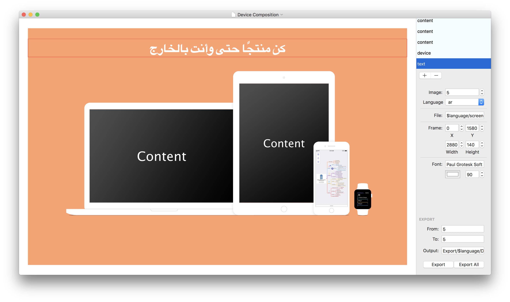
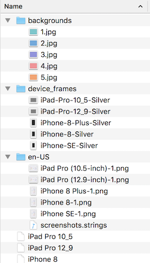
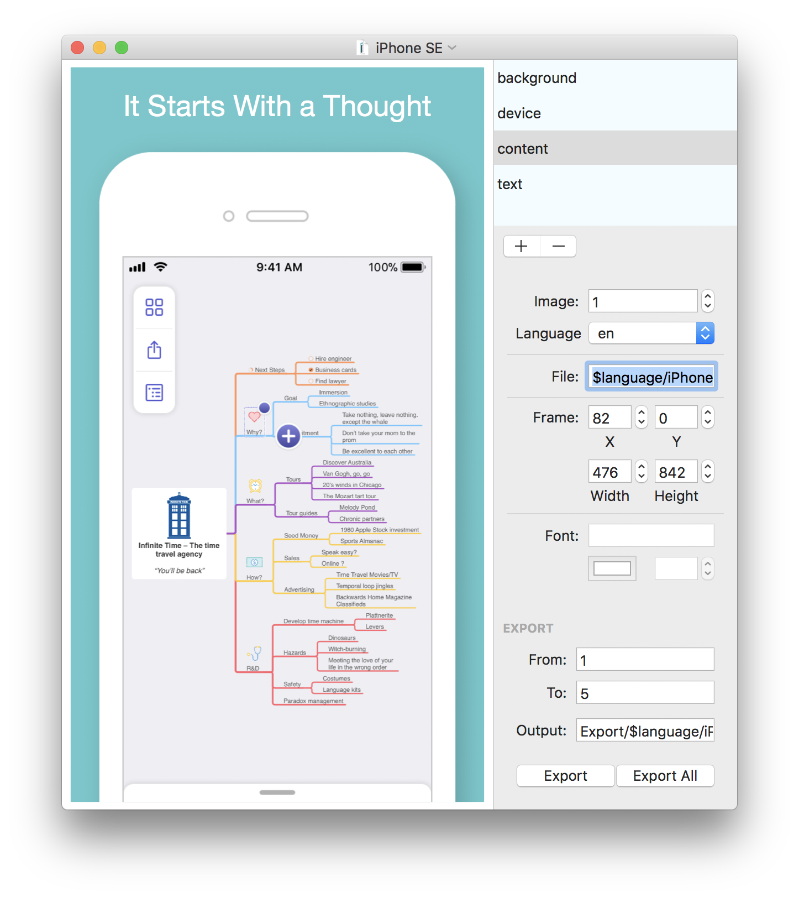

# ScreenshotFramer
[](https://twitter.com/PatrickKladek)


With Screenshot Framer you can create Localized App Store Images.


### How does it work

Screenshot Framer simply put pictures on top of each other and saves the image to disk.
You can specify the path of every image layer and use a `.strings` file for the text layers. You can than export all possible Image & Language combinations


### Preparation

Download the Sample Project here or create your own project structure.
When you are using Fastlanes snapshot you can reuse that folder structure and only add missing files:



##### backgrounds
If you want a background other that white

##### device_frames
If you want your screenshots framed in a device. You may use any Image here. It is useful if the images support alpha values. Unfortunatley we can not give you our device images due to copyrights. You can download apples device images and copy them in this folder. It may be neccesary to export them as png tho.

##### localized image Folder
(en-US, de-DE and so on) are generated using Fastlane snapshot oder you may also copy them in this folders. Important is that you have a strings file in this folder called `screenshots.strings`

```
"1" = "It Starts With a Thought";
"2" = "Add Your Thoughts";
"3" = "Discover Connections";
"4" = "Visualize Your Idea";
"5" = "Productive on the Go";
```

##### Configuration File
This file contain the configuration for the image export.
Open the file `iPhone SE` and change the number in image textfield or language popup. You may also change the position and size of each layer or create new layers.


### Usage

You create your Images like in your favorite Image editing App.
The main difference is that you can specify variables and use them for the image path.
Possible Variables:

* `$image` can contain only numbers (typically 1-5)
* `$language` contains every sub-folder name in your project folder (in this case `Sample Project`) excluding `backgrounds, device_frames and Export`

In the screenshot below the File is: `$language/iPhone SE-$image.png`. This is automatically translated to `en-US/iPhone SE-1.png` and exaclty this file is rendered.



When you are happy with the output you can check how the screenshots look in different languages by simply changing the languge popup and change the image number. You can than export the images by clicking `Export All`. You can also specify which images are created by changing `From` and `To` Values


### Known limitations & bugs
* No rearanging of layers (drag and drop in tableView)
* May use exessice amount of memeory while exporing (up to 4GB)
* no ascpect ratio lock. keep that in mind if you scale images
* For better overview output is set to `Export/$language/iPhone SE-$image framed.png` but you could also remove `Export` from and Fastlane Upload to itunesconnect should work (not tested)

Callisto is brought to you by IdeasOnCanvas, the creator of MindNode for iOS, macOS & watchOS.
